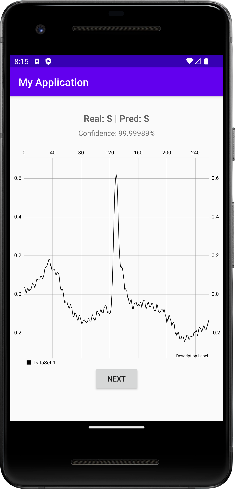

# About Project
In this project, we aim to build a mobile arrhythmia classifier system. The model was developed in Python using Tensorflow as the deep learning framework.
The model was compressed using quantization[1] in order to make the model smaller and faster in computation. Finally, the model was deployed to the android app as a proof-of-concept.

This repo is for the code of deployment and inference testing.

## Structure
- **Python** - contains code for the classification model testing
- **android/ECG Test** - contains android app project

## Classifier model
The model was adapted from acharya's model[2], using a 9 layers-deep Convolutional Neural Network (CNN). The model was trained using MIT-BIH arrhythmia database[3]. The model was then compressed using quantization[1] technique. 

## Android app
The android app here is a proof-of-concept. It was built as a testing bed for testing the inference processing time of the model in the smartphone.

The app will show the class of prediction vs true class. It also shows the confidence level of its top prediction

## References
[1] B. Jacob et al., "Quantization and Training of Neural Networks for Efficient Integer-Arithmetic-Only Inference", Proc. IEEE Comput. Soc. Conf. Comput. Vis. Pattern Recognit., pp. 2704-2713, Dec. 2017.

[2] U. R. Acharya et al., "A deep convolutional neural network model to classify heartbeats", Comput. Biol. Med., vol. 89, pp. 389-396, Oct. 2017.

[3] G. B. Moody and R. G. Mark, "The impact of the MIT-BIH arrhythmia database", IEEE Eng. Med. Biol. Mag., vol. 20, no. 3, pp. 45-50, 2001.
